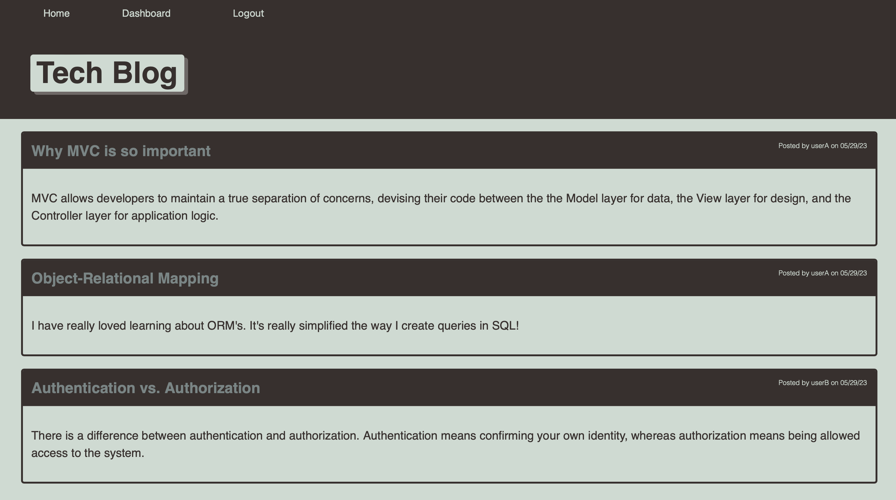

# 18: Tech Blog     

## Description

A [blog site](https://rkgs-tech-blog.herokuapp.com) for developers to publish their thoughts on tech and comment on their peers. Built following the MVC paradigm with Express.js, MySQL, Handlebars.js, and Sequelize.
  

## Table of Contents

- [Installation](#installation)
- [Usage](#usage)
- [License](#license)
- [Tests](#tests)
- [Credits](#credits)
- [How to Contribute](#how-to-contribute)
- [Questions](#questions)

## Installation
N/A

## Usage
Visit the [deployed site](https://rkgs-tech-blog.herokuapp.com).
View the latest blog posts on the homepage. Signup/login to create your own posts or add comments to existing posts. 

## License

This project is covered under the following license: MIT License  
Refer to LICENSE in the repo for additional details.

## Tests

N/A

## Credits

N/A

## How to Contribute

[Contributor Covenant](https://www.contributor-covenant.org/)

## Questions

For questions or suggestions, contact:  
GitHub: [@aerostokes](https://github.com/aerostokes)  
Email: [rhonda@aerostokes.com](mailto:rhonda@aerostokes.com)